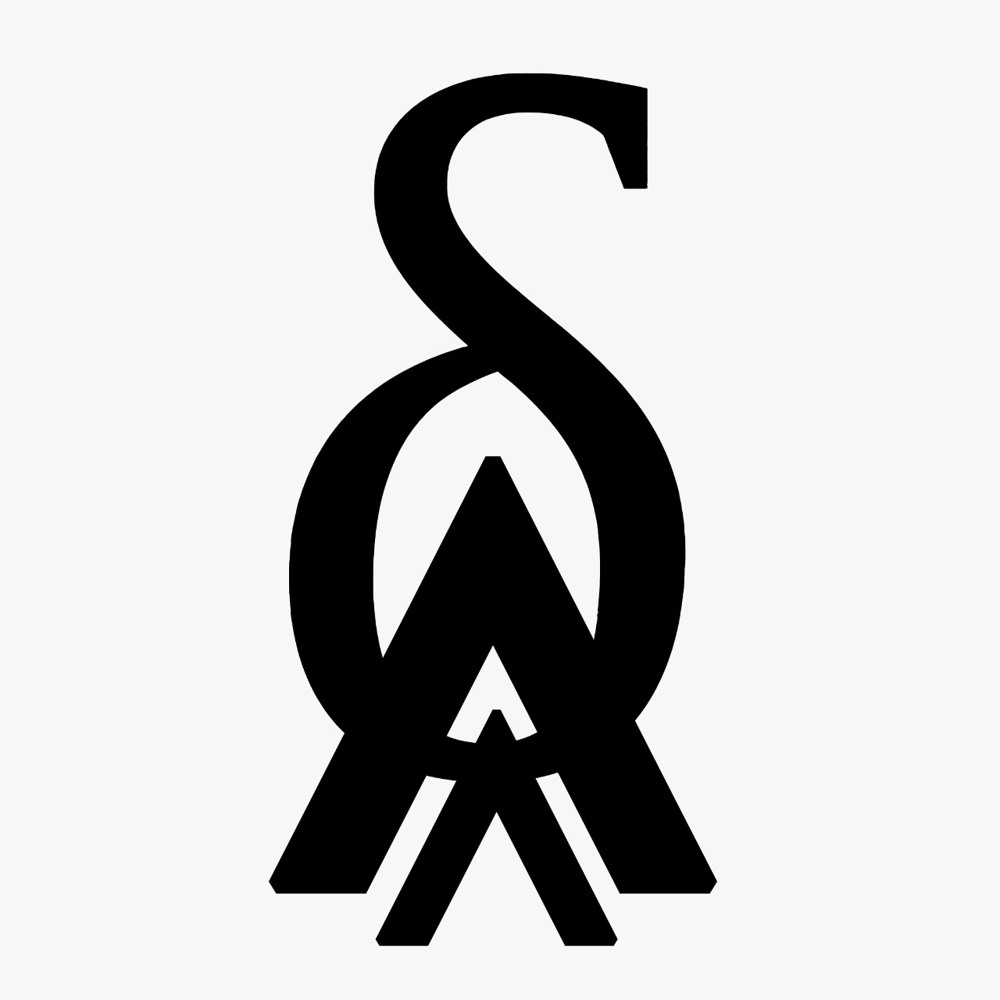

# Pascal

### Website for a (fictional) futuristic car company - Pascal
## Table of Contents
- [Features](#features)
- [Tech Brief](#tech-brief)
- [Acknowledgements & Contributions](#acknowledgements--contributions)

This website showcases the products and values of Pascal. Pascal strives to innovate solutions to make the car industry carbon neutral by building 100% electric cars. 

## Features
- Aesthetic & Elegant Website
- Integrated 3D Model Viewer
- Brand Identity
- Vibrant Colour Scheme
- About Us

## Tech Brief
- React
- NextJS
- SASS

## Acknowledgements & Contributions
- [WARP Club](https://warpclub.in)
- [Jishnu Prasad Samal](https://jishnupsamal.ml)

&copy; Warp Club

